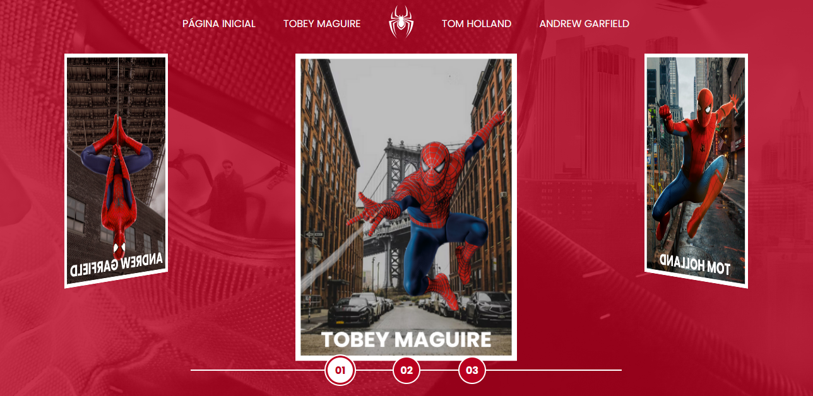

# Multiverso Spider-man

## :rocket: Descrição do projeto

Desenvolvido as páginas dos filmes do homem aranha de 2004 até o de 2021. Este projeto faz parte do desafio de código da [DIO](https://dio.me).

## :books: Modificações

- Implementado layout que se adequa para diferentes tipos de monitores.

## :speech_balloon: Conheça mais dos meus projetos

Me adicione no Linkedin :point_right: [Leonardo Abdala](https://www.linkedin.com/in/leonardo-abdala/) e no Github, vamos desenvolver juntos. :facepunch:
